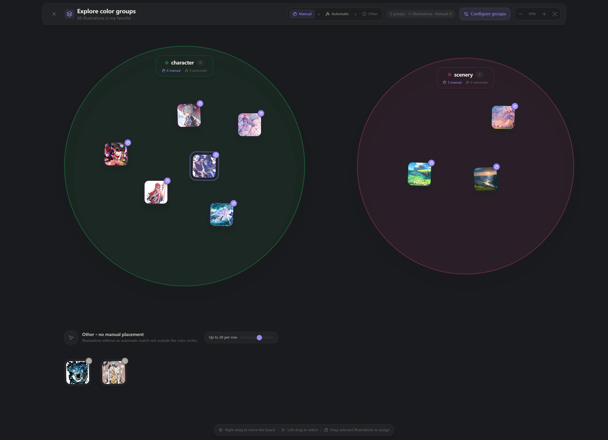
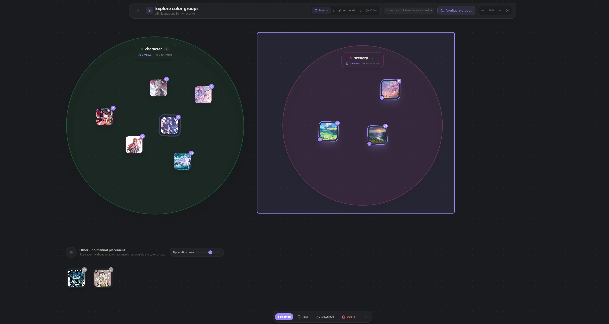
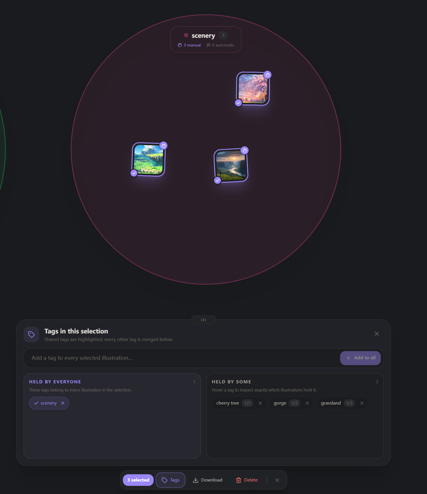
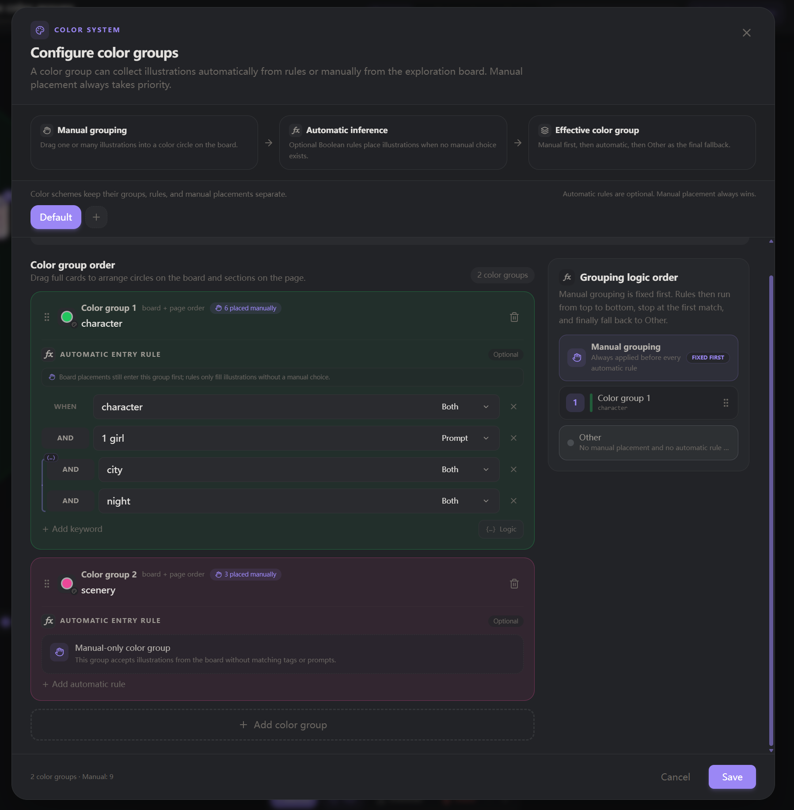
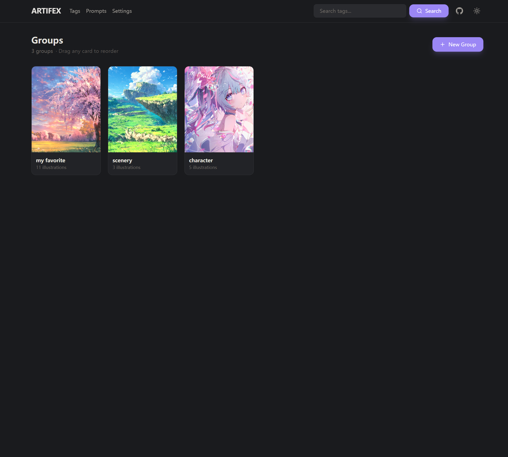
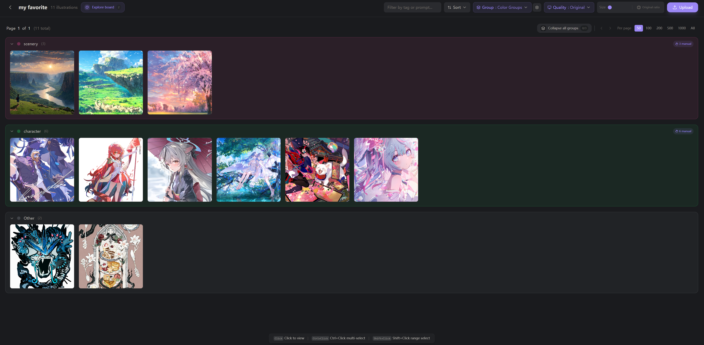
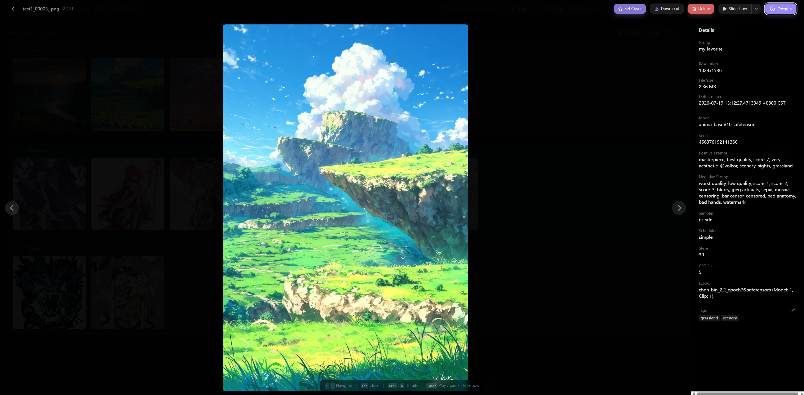
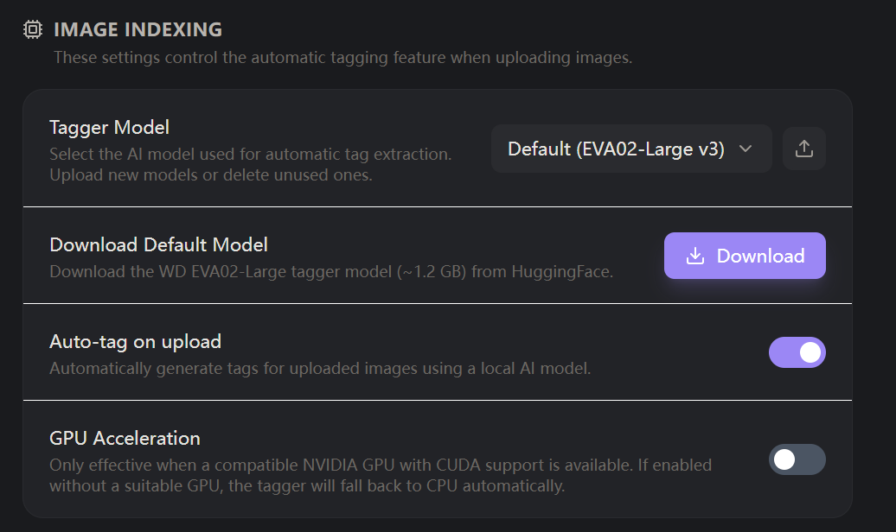

# Artifex

[](README.md)
[](readme/readme_zh.md)
[](https://github.com/lizzary/Artifex/releases)
[](LICENSE)

**Artifex is a local-first, self-hosted workspace for ComfyUI output.** It
extracts generation metadata from PNG files, can tag images with a local vision
model, and gives large libraries a gallery, full-text tag search, batch tools,
and an interactive color-group board.

Your database and images stay on your machine. Artifex has no cloud account and
no telemetry; network access is only needed when you explicitly download a
release or the optional tagging model.

<p align="center">
  <a href="readme/access/whiteboard-color-group.png">
    
  </a>
  <br>
  <sub>Interactive color-group board: manual placement, automatic rules, and the Other fallback.</sub>
</p>

## What Artifex does

- **Interactive color-group board** — place one or many images into colored
  circles, box-select a region, pan and zoom the board, and manage the selected
  images without leaving the canvas.
- **Manual-first smart grouping** — a manual board placement wins; optional
  Boolean rules then classify the remaining images; anything unmatched goes to
  **Other**.
- **ComfyUI metadata extraction** — reads model, prompts, seed, sampler,
  scheduler, steps, CFG, LoRAs, resolution, file size, and creation time from
  PNG metadata without requiring ComfyUI to be installed.
- **Local AI tagging** — runs WD EVA02-Large Tagger v3 through ONNX Runtime,
  with CPU inference by default and optional CUDA acceleration.
- **Fast local browsing** — SQLite-backed galleries, tag-prefix search,
  tag/prompt filters, sorting, pagination, three image quality levels, and an
  original-aspect-ratio view.
- **Complete library workflow** — drag-and-drop upload, duplicate-name policies,
  editable tags, batch re-tag/download/delete, configurable download names, and
  a keyboard-friendly lightbox with slideshow playback.
- **Local, portable storage** — SQLite, settings, models, originals, and
  thumbnails live beside the application unless you choose custom paths.

## Quick start

### 1. Download a release

Open the **[latest release](https://github.com/lizzary/Artifex/releases/latest)**
and download the archive for your platform:

| Platform | Release archive | Executable |
| --- | --- | --- |
| Windows x64 | `artifex-windows-amd64.zip` | `artifex.exe` |
| Linux x64 | `artifex-linux-amd64.tar.gz` | `artifex` |
| macOS Apple Silicon | `artifex-darwin-arm64.tar.gz` | `artifex` |

Intel macOS builds are not currently published.

### 2. Extract and double-click to start

Keep the executable, the ONNX Runtime library, and the `frontend/` directory
together as shipped in the archive.

Open the extracted folder and double-click the executable for your platform:

- Windows: `artifex.exe`
- Linux / macOS: `artifex`

Artifex prints the actual gallery URL in its terminal interface. It starts at
`http://127.0.0.1:8000`; if that port is occupied, it tries the next ports in
sequence (30 attempts by default). Type `/open` in the terminal UI to open the
gallery in your browser.

### 3. Optional: enable automatic tagging

The default model is not bundled with releases. In the web UI, open
**Settings → Image Indexing → Download Default Model**. The verified model is
about **1.2 GB** and is stored locally under `models/default/`.

You can use galleries, metadata, manual tags, search, color rules, and the
whiteboard without the model. If the model is unavailable during upload, choose
to continue without automatic tags.

## The color-group board

The board is a spatial view of one gallery. Every configured color group is a
circle; images without an effective group remain in the **Other** area.

The grouping pipeline is deliberately predictable:

```text
manual board placement  >  first matching automatic rule  >  Other
```

Dragging a card changes its group membership, not a permanently saved freeform
coordinate. Artifex calculates a deterministic layout so the board stays tidy
as the library changes.

### Board controls

| Action | Result |
| --- | --- |
| Click a card | Select it |
| `Ctrl` / `Cmd` + click | Add or remove one card from the selection |
| `Shift` + click | Select a range |
| Left-drag empty space | Draw a selection box |
| Drag selected cards into a circle | Assign all selected images manually |
| Drag selected cards outside every circle | Clear manual placement and return them to automatic rules |
| Right-drag | Pan the board |
| Mouse wheel or `+` / `−` | Zoom around the pointer from 50% to 200% |
| Fit button | Fit all color groups in view |

<p align="center">
  <a href="readme/access/whiteboard-color-group-selected-some-ills.png">
    
  </a>
  <br>
  <sub>Box-select multiple illustrations, then move or manage the entire selection.</sub>
</p>

The **Other** grid can show 5–30 thumbnails per row. Hovering any card opens a
clear, original-ratio preview with its filename and grouping source.

### Board batch tools

The selection dock can download or delete the current selection and opens an
advanced tag panel that:

- separates tags held by every selected image from tags held by only some;
- adds one or several tags to the whole selection;
- removes a shared tag from every selected image;
- shows exactly which images hold a partial tag and can remove it selectively.

Files can also be dragged from the operating system onto the gallery while the
board is open; upload progress remains visible in the board header.

<p align="center">
  <a href="readme/access/whiteboard-tags-menu.png">
    
  </a>
  <br>
  <sub>Batch tags distinguish values held by every selected illustration from those held by only some.</sub>
</p>

### Manual placement and automatic rules

Automatic rules are optional. A color group may be entirely manual, or it can
fill unassigned images using conditions sourced from:

- exact tags, matched case-insensitively;
- positive and negative prompt text, matched as case-insensitive substrings;
- both sources together.

Rules support `AND`, `OR`, `NOT`, and nested parentheses. `AND` binds more
tightly than `OR`; parentheses and `NOT` are evaluated first. Automatic rules
run in their own priority order and stop at the first match.

Display order and rule priority are independent: one controls circle/page
placement, while the other controls first-match evaluation. Color groups also
support custom names, palette colors, exact hexadecimal colors, and multiple
independent configuration sets. Each set keeps its groups, rules, priorities,
and manual assignments separate.

<p align="center">
  <a href="readme/access/color-config-menu.png">
    
  </a>
  <br>
  <sub>Configure colors, manual-only groups, nested automatic rules, display order, and grouping priority.</sub>
</p>

### DOM and WebGL renderers

Choose the board renderer under **Settings → General**:

| Setting | Use case |
| --- | --- |
| **Auto (recommended)** | Uses the proven compatibility path selected by the current release |
| **WebGL performance** | PixiJS/WebGL 2 renderer with viewport culling and lazy texture loading for large boards |
| **DOM compatibility** | Accessible HTML renderer for maximum browser and GPU compatibility |

If WebGL 2 is unavailable or its context is lost, Artifex falls back to the DOM
renderer. The WebGL board also supports keyboard navigation with arrow keys,
`Home` / `End`, and `Enter` / `Space` for selection.

## Gallery workflow

<p align="center">
  <a href="readme/access/front-page.png">
    
  </a>
  <a href="readme/access/ills-preview-page-with-3-color-group.png">
    
  </a>
  <br>
  <sub>Gallery groups overview (left) and a color-grouped gallery with its browsing controls (right).</sub>
</p>

### Galleries and upload

- Create, rename, delete, and drag to reorder top-level galleries.
- Set a gallery cover from the grid or the lightbox.
- Upload through the file picker or drag files onto the gallery/board.
- Review a final summary of added, skipped, overwritten, and failed files.
- Choose how duplicate original filenames inside the same gallery are handled:
  **Save all**, **Skip**, or **Overwrite**.
- Re-run the AI tagger on a selection; re-tagging replaces the current tags.

Artifex accepts JPEG, PNG, GIF, and WebP. Originals are preserved without
transcoding. A 400 px thumbnail (quality 75) and a 1200 px thumbnail (quality
85) are generated during upload; missing thumbnails are rebuilt on demand.

### Browse, sort, filter, and select

- Sort by default/newest order, resolution area, file size, or creation time,
  in ascending or descending order.
- Filter the current gallery or search result by exact tags, positive prompts,
  negative prompts, or both.
- Switch among low (400 px), normal (1200 px), and original quality.
- Adjust card size and choose square crops or the full original aspect ratio.
- Use page sizes of 50, 100, 200, 500, 1000, or All.
- Apply color grouping to the grid and collapse individual color sections.
- Use `Ctrl` / `Cmd` click and `Shift` click for batch re-tag, download, or
  delete.

### Search, tags, and prompts

The header search uses a SQLite FTS5 index over **tags**. It performs prefix
matching, so `suns` can match `sunset`, and multiple terms are combined with
`AND`.

Prompts are not part of the global FTS index. They remain available in:

- the `/prompts` reference page;
- gallery and search-result filters;
- color-group automatic rules.

The `/tags` and `/prompts` pages provide filterable reference lists for the
vocabulary already present in the library.

## Lightbox, metadata, and tags

Click an image to open the original in the full-screen lightbox. From there you
can navigate, set the gallery cover, download, delete, edit tags, inspect
details, or start a slideshow.

| Shortcut | Action |
| --- | --- |
| `←` / `↑` | Previous image |
| `→` / `↓` | Next image |
| `Ctrl` / `Cmd` + `D` | Toggle the details panel |
| `Space` | Play or pause the slideshow |
| `Esc` | Close the lightbox |

Slideshow intervals can be set from 1–60 seconds, with 2/3/5/10 second presets.

For ComfyUI PNGs, the details panel can expose:

| Category | Extracted values |
| --- | --- |
| File | gallery, resolution, file size, creation time |
| Generation | model, seed, sampler, scheduler, steps, CFG scale |
| Prompts | positive and negative prompts |
| Add-ons | LoRA names plus model/CLIP strengths |
| Library | editable tags |

Artifex reads embedded ComfyUI `prompt` and `workflow` JSON from supported PNG
text metadata. Non-PNG files and PNGs without a supported workflow still retain
their basic file information.

<p align="center">
  <a href="readme/access/lightbox-with-comfyui-meta.png">
    
  </a>
  <br>
  <sub>The lightbox keeps the original image beside its embedded ComfyUI generation details.</sub>
</p>

## Local AI tagging

The default tagger is
[WD EVA02-Large Tagger v3](https://huggingface.co/lizzary111/wd-eva02-large-tagger-v3),
executed locally through ONNX Runtime.

- Default inference is CPU-only.
- CUDA can be enabled in Settings; initialization failures fall back to CPU and
  are reported in the application log.
- The default download is pinned to a known revision and verifies expected file
  sizes and SHA-256 hashes before replacing the active model.
- Custom `.onnx` and `.csv` model files can be uploaded and selected in
  Settings.
- Automatic tagging can be disabled completely.

<p align="center">
  <a href="readme/access/model-setting.png">
    
  </a>
  <br>
  <sub>Select or upload a tagger model, download the default model, and control automatic tagging and GPU acceleration.</sub>
</p>

Official release archives contain ONNX Runtime but **not** the tagging model.

## Settings and persistence

Server-side `settings.json` stores:

- automatic tagging, GPU choice, and active model;
- duplicate-name policy;
- gallery order;
- color-group sets, rules, priorities, and manual assignments;
- terminal theme and port-attempt limit.

Browser-local preferences store language, light/dark theme, thumbnail quality,
card size, original-ratio mode, color-group view state, download naming format,
slideshow interval, board renderer, and the **Other** row limit.

By default, the application creates this data beside the executable:

```text
artifex-directory/
├── artifex[.exe]
├── frontend/                 # shipped web application; keep beside the binary
├── onnxruntime.*             # platform runtime library shipped in releases
├── gallery.db                # SQLite database
├── settings.json             # created after settings are saved
├── models/
│   ├── default/
│   └── user_model/
└── uploads/
    └── <gallery-id>/
        ├── originals/
        ├── thumbnails/       # 400 px
        └── thumbnails_normal/ # 1200 px
```

### Download filename templates

Downloads preserve the original extension. The template is case-sensitive and
supports these placeholders:

`<date>`, `<Resolution>`, `<File Size>`, `<Date Created>`, `<group>`,
`<Model>`, `<Seed>`, `<Sampler>`, `<Steps>`, `<CFG Scale>`, and `<Lora>`.

Invalid filename characters and unresolved placeholders are removed. If the
result is empty, Artifex uses the original filename.

## Terminal interface

Starting Artifex in a terminal opens a Bubble Tea status interface. Use
`-no-ui` for plain logs in services, scripts, or containers.

| Command | Purpose |
| --- | --- |
| `/status` | Show the current server state |
| `/log` | Open the scrollable application log |
| `/theme auto\|dark\|light` | Change and persist the terminal theme |
| `/port-attempts 1-65536` | Set the consecutive-port retry limit for the next start |
| `/upload-workers 1-32` | Set concurrent image preparation workers; applies immediately to new uploads |
| `/tagger-slots 1-16` | Set concurrent tagger inference slots; applies immediately to new inference work |
| `/open` | Open the current gallery URL |
| `/home` | Return to the status screen |
| `/help` | List commands |
| `/quit` or `/exit` | Stop Artifex |

The log view supports arrow keys, Page Up/Down, `End`, `f` to toggle follow
mode, and `1`–`4` to filter log levels.

## Build from source

### Requirements

| Dependency | Current project requirement |
| --- | --- |
| Go | 1.26.4 (from `backend-go/go.mod`) |
| Node.js | 20 (used by the release workflow) |
| C toolchain | Required because the backend uses CGO |
| ONNX Runtime | 1.26.0 shared library |

The current backend always includes the ONNX binding. There is no CGO-disabled
or pure-Go backend build.

### 1. Clone and build the frontend

```bash
git clone https://github.com/lizzary/Artifex.git
cd Artifex/frontend
npm ci
npm run build
```

This creates `frontend/build/`. In the repository layout, the backend detects
that directory automatically.

### 2. Install ONNX Runtime 1.26.0

Download the matching archive from the
[ONNX Runtime v1.26.0 release](https://github.com/microsoft/onnxruntime/releases/tag/v1.26.0)
and make its shared library available to the executable:

- Windows: `onnxruntime.dll`
- Linux: `libonnxruntime.so*`
- macOS: `libonnxruntime*.dylib`

The official Artifex release workflow places these files beside the executable
and adds an executable-relative runtime search path on Linux/macOS.

### 3. Build the backend

**Windows PowerShell:**

```powershell
cd ..\backend-go
$env:CGO_ENABLED='1'
go build -trimpath -ldflags="-s -w" -o artifex.exe .
```

**Linux / macOS:**

```bash
cd ../backend-go
CGO_ENABLED=1 go build -trimpath -ldflags="-s -w" -o artifex .
```

After the build finishes, open the `backend-go` directory in your file manager
and double-click `artifex.exe` on Windows or `artifex` on Linux/macOS.

For frontend hot reload, keep the backend running and, in a new terminal from
the repository root, start React with the backend's actual URL:

```powershell
cd frontend
$env:REACT_APP_API_BASE_URL='http://127.0.0.1:8000'
npm start
```

```bash
cd frontend
REACT_APP_API_BASE_URL=http://127.0.0.1:8000 npm start
```

The React development server listens on `http://localhost:3000` by default.

### Tests

```bash
cd frontend
CI=true npm test -- --watchAll=false

cd ../backend-go
CGO_ENABLED=1 go test ./...
```

### Runtime flags

| Flag | Default | Description |
| --- | --- | --- |
| `-host` | `127.0.0.1` | Listen address |
| `-port` | `8000` | First port to try |
| `-db` | `<base>/gallery.db` | SQLite database path |
| `-uploads` | `<base>/uploads` | Original and thumbnail storage |
| `-models` | `<base>/models` | Default and custom model storage |
| `-frontend` | auto-detected | Built frontend directory |
| `-cli-theme` | saved setting | `auto`, `dark`, or `light` terminal theme |
| `-no-ui` | `false` | Disable the interactive terminal interface |

The server defaults to loopback. If you set `-host 0.0.0.0`, Artifex becomes
reachable on your network and does not add authentication; only do this on a
trusted network or behind your own access control.

## Architecture

| Layer | Implementation |
| --- | --- |
| Frontend | React 19, React Router 7, Tailwind CSS 3, Framer Motion, Lucide |
| Board | DOM compatibility renderer plus PixiJS 8 / WebGL 2 renderer |
| Backend | Go 1.26, Chi router, Bubble Tea/Lipgloss terminal UI |
| Storage | SQLite in WAL mode, with FTS5 for tag search |
| Metadata | Native Go PNG chunk and ComfyUI workflow parser |
| Imaging | Original files plus 400 px and 1200 px JPEG thumbnails |
| Tagger | `onnxruntime_go`, ONNX Runtime 1.26.0, WD EVA02-Large Tagger v3 |
| Packaging | Executable + external `frontend/` + platform ONNX Runtime library |

Repository layout:

```text
Artifex/
├── backend-go/
│   ├── main.go
│   └── internal/
│       ├── cli/
│       ├── database/
│       ├── metadata/
│       ├── server/
│       ├── settings/
│       ├── tagger/
│       └── thumbnail/
├── frontend/
│   ├── public/
│   └── src/
│       ├── components/
│       │   └── color-board/
│       ├── hooks/
│       ├── pages/
│       └── utils/
├── readme/access/          # README screenshots
└── .github/workflows/release.yml
```

## Troubleshooting

### The frontend is blank or returns 404

Keep the release archive intact so `frontend/index.html` remains beside the
executable, or build `frontend/build/` from source. A custom directory can be
provided with `-frontend`.

### ONNX Runtime fails to initialize

Make sure the platform shared library shipped with the release is still beside
the executable. Source builds must use the ONNX Runtime version expected by the
project (currently 1.26.0) and a matching architecture.

### The default model is unavailable

Open **Settings → Image Indexing → Download Default Model**. A failed or partial
download is not activated; Artifex verifies the files before replacing the
current model. You may continue uploading without automatic tags.

### CUDA does not start

Official archives include the CPU runtime. CUDA requires compatible provider
libraries and drivers. Artifex logs the initialization failure and falls back
to CPU; disable GPU acceleration if you do not intend to install them.

### WebGL mode does not start

Use **Settings → General → Board renderer → DOM compatibility**. Artifex also
falls back automatically when WebGL 2 is unavailable.

### Port 8000 is occupied

Read the actual URL printed by the terminal. Artifex normally tries ports
8000–8029. Change the next-start limit with `/port-attempts`, or set a different
starting port with `-port`.

## License

[MIT](LICENSE) © 2026 Perry Wong.
